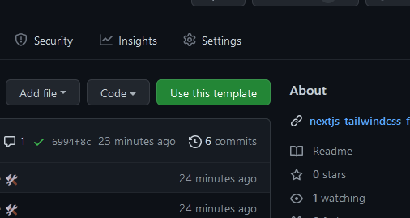
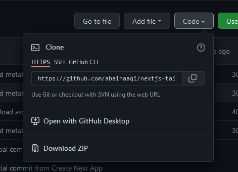

This is a [Next.js](https://nextjs.org/) project bundled with Tailwindcss and meta tags generator.

# What's already installed

- [Tailwindcss](https://tailwindcss.com)
- Meta tags generator

## Tailwindcss

I change the base font size in the tailwind.config.js

```javascript
fontSize: {
  'sm': '0.9rem',
  'base': '1rem',
  'md': '1.5rem',
  'lg': '2rem',
  'xl': '2.5rem',
  '2xl': '3rem',
  '3xl': '4rem'
}
```

Delete this code if you want default tailwind styling

# Getting Started

1. [Use this template](https://github.com/abaihaaqi/nextjs-tailwindcss/generate) :



2. Clone it to your computer



3. Start working your project

## [Demo template &#8599;](nextjs-tailwindcss-flax.vercel.app)
